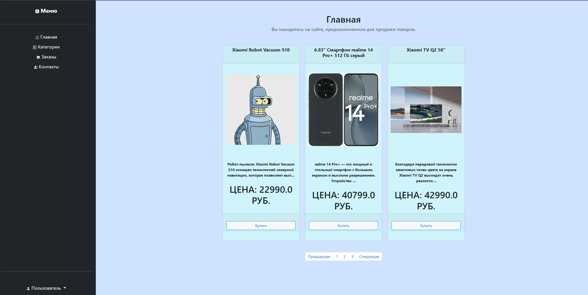

# 
 Проект интернет-магазина 

Заготовка для интернет магазина с использованием фреймворка django

##  
Установка:

1. Клонируйте репозиторий: git@github.com:gabdrakhmanov-D//An-example-of-an-online-store.git
2. Обновите зависимости с помощью команды `poetry update`.

## 
Описание:  

Проект содержит одно приложение catalog. В приложении используются три веб-страницы:
  - Главная
  - Контакты
  - Страница благодраности за обратную связь.

## 
Запуск:

Для демонстрации работы приложения, активируйте виртуальное окружение и выполните команду `python manage.py runserver`.

Чтобы подключить базу данных заполните шаблон .env.sample

## 
Особенности:

В приложении есть форма обратной связи, все данные полученные из этой формы выводятся в консоль.

## 
Изменения в версии 2.0:  

- Подключена база данных PostgreSQL. Настройки работы с БД вынесены в переменные окружения в файл .env.
- Созданы модели товаров, категорий и контактов магазина. Выполнены миграции.
- Для этих моделей настроено корректное отображение в административной панели.
- Сформированы фикстуры для продуктов и категорий.
- Реализована кастомная команда для загрузки объектов.
